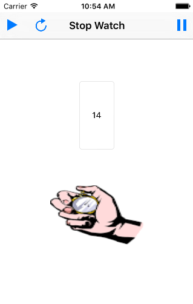

#instruction



```
git clone git@github.com:jrose111284/Stop_Watch.git
```

to run this app, open this app with xcode and press

```
cmd + r
```

this will run the iphone simulator

#what it does

This was just a 1 day app i made. It can play  the stop watch, pause, resume
and reset the timer.

could do with a little more visual quality but the app was more about learning
the swift code then making it look pretty. Something for a future feature.
